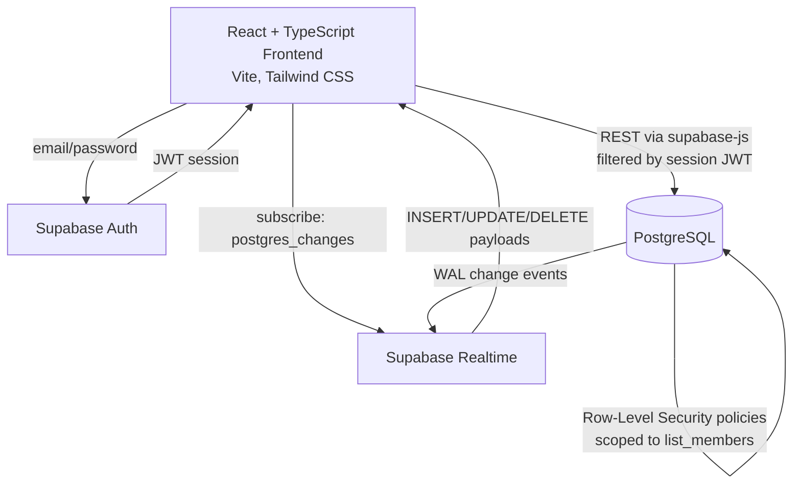

# Architecture Diagram

## Data flow

## Layer-by-layer

**1. Frontend (React + TypeScript, Vite)**
Pages (`src/pages/`) consume custom hooks (`useItems`, `useCategories`, `useActiveList`, `useAuth`) that own all Supabase calls. No component talks to `supabase-js` directly except a handful of pages doing a one-off `list_members` read (documented inline where that happens).

**2. Supabase Auth**
Email/password auth (`supabase.auth.signInWithPassword` / `signUp`). The session JWT is attached automatically to every subsequent Postgrest and Realtime call by the `supabase-js` client — the frontend never manually passes a token.

**3. PostgreSQL with Row-Level Security**
Every table (`lists`, `list_members`, `items`, `categories`) has RLS policies that check the requesting user's JWT against `list_members` — a user can only read/write rows belonging to lists they're a member of. This is enforced by Postgres itself, not just filtered client-side, so a compromised or modified client still can't read another household's list.

**4. Supabase Realtime**
Each of `useItems` and `useCategories` opens a `postgres_changes` subscription (via `useRealtimeTable`, `src/hooks/useRealtimeTable.ts`) scoped to the active list's rows. When any member inserts, updates, or deletes a row, Postgres's write-ahead log emits a change event, Realtime relays it over a WebSocket to every subscribed client, and the hook merges it into local state (`upsertById`/`removeById`) — no polling, no manual refresh.

## What is *not* wired to Realtime (by design)

- **Presence** (who's currently online) — would require a separate Supabase Presence channel; not implemented, and the UI intentionally shows real membership without fabricating an online/offline status.
- **Typing indicators / live cursors** — same reasoning; would require Broadcast channels, not implemented.
- **Activity history with timestamps** — `items`/`categories` have no timestamp columns, so a genuine "added 2 minutes ago" feed isn't possible without a schema change.

These are documented as future work in the main [README](../README.md#future-roadmap) rather than faked in the UI.
