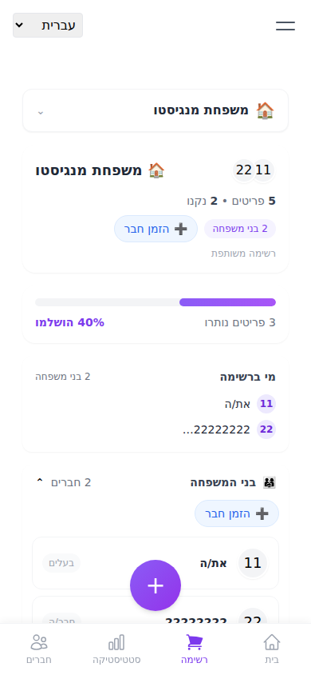
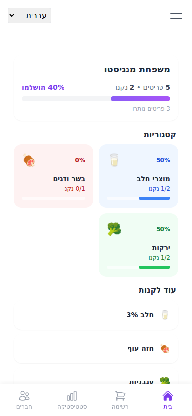
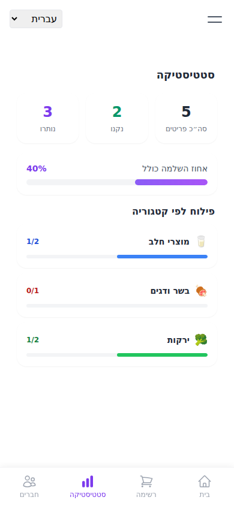
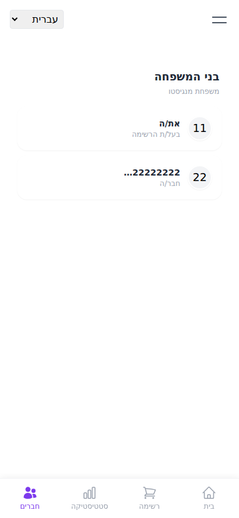

# Screenshots

Captured from the running app (mobile viewport, 390×844) using representative demo data — not a live production household's real data.

## Shopping List

The main shared list: real-time item toggling, category filtering, and membership, grouped by category with per-category progress.

## Dashboard

Category completion tiles and a "still to buy" summary, derived entirely from live item/category state.

## Statistics

Total/completed/remaining counts and a per-category breakdown — computed from current data only (no fabricated historical trends; see [`architecture-diagram.md`](architecture-diagram.md#what-is-not-wired-to-realtime-by-design) for why).

## Family Members

Real list membership (by user ID — no `profiles` table yet, tracked in the [roadmap](../README.md#future-roadmap)).

