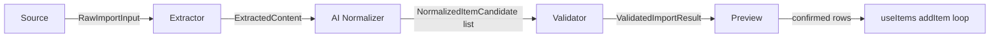

# Smart Import — Architecture (v2, approved)

Status: **Phase 1 and Phase 2 implemented.** This supersedes the original chat proposal — six changes were requested during Phase 1 review and are incorporated below. Anything not explicitly called out as "Phase 1: real" is a stub (valid interface, registered, `isAvailable()` → `false` or `throws not implemented`) per the original "infrastructure only" scope. Phase 2 (see its own section below) adds a real AI Analysis stage between Validator and Preview.

## Changes from the original proposal

1. **Entry point moved to the Lists screen** (`src/pages/Lists.tsx`), not `HeaderMenu2`.
2. **Import Preview** must support, per row: edit name, quantity, unit, category, notes, include/exclude.
3. **All future providers are shown in the UI**, unavailable ones rendered "Coming Soon" — never hidden.
4. **Pipeline replaced**: `Source → Parser` becomes `Source → Extractor → AI Normalizer → Validator → Preview`.
5. **`WhatsAppScreenshotSource` renamed to `ImageSource`** — a source describes the *input type* it produces, never the app it came from.
6. **The normalization stage is provider-agnostic** — its interface has no knowledge of any specific AI vendor. Phase 1 ships a non-AI, rule-based implementation of that same interface; a real AI-backed implementation is a Phase 2+ concern that must satisfy the identical contract.

## Why the pipeline change reshapes the source list

The original 10-item feature list ("Paste Text, AI Parsing, Image OCR, Camera, Gallery, CSV, Excel, Apple Reminders, Google Keep, WhatsApp screenshots") mixed two different concerns: *how input is obtained* and *how it's turned into structured data*. The new 5-stage pipeline separates them on purpose:

- **"AI Parsing"** was never really a Source — it's what the **AI Normalizer** stage does, for every source, uniformly.
- **"Image OCR"** was never really a separate Source either — OCR is what the **Extractor** stage does to an image, regardless of whether that image came from the camera, the gallery, or a shared screenshot.

So the *Source* list shrinks to genuine input channels — each one just answers "how did the user hand us something?" — while OCR/CSV-parsing/AI-normalization move to their proper pipeline stages:

| Original list item | Now lives as |
|---|---|
| Paste Text | Source: `paste-text` |
| Camera | Source: `camera` |
| Gallery | Source: `gallery` |
| WhatsApp screenshots | Source: `image` (renamed — see change #5; a shared screenshot is just one way to obtain an image, not a distinct input type from camera/gallery) |
| CSV | Source: `csv` |
| Excel | Source: `excel` |
| Apple Reminders | Source: `apple-reminders` |
| Google Keep | Source: `google-keep` |
| Image OCR | Extractor: `ocr` (shared by `camera`/`gallery`/`image` sources) |
| AI Parsing | The AI Normalizer stage itself (shared by every source) |

This is a direct payoff of decoupling Source from processing: three different acquisition UX flows (take a photo / pick from gallery / attach a saved screenshot) all produce the same shape of raw input (an image file) and can share one `OcrExtractor` — exactly the kind of reuse the pluggable pipeline is meant to enable, and exactly why `ImageSource` is named for what it *is* (an image) rather than where it came from.

## Pipeline



- **Source** — obtains raw input (`{ kind: 'text' }` or `{ kind: 'file' }`). Knows nothing about parsing.
- **Extractor** — turns raw input into flat text lines or tabular rows. Knows nothing about categories, AI, or validation. Picked by capability (`accepts(input)`), not by a hardcoded source→extractor map — so a source never needs to "know" its extractor.
- **AI Normalizer** — the *only* stage allowed to guess structure (name/quantity/unit/category/notes) from unstructured lines/rows. Provider-agnostic interface; Phase 1's implementation (`RuleBasedNormalizer`) does this with plain regex/string heuristics and **makes zero network calls** — deliberately, both to keep Phase 1 dependency-free and to prove the interface doesn't secretly require an AI vendor to function.
- **Validator** — required-field checks, in-list duplicate-name detection, quantity/unit sanity clamping. Produces `issues[]` (warnings/errors) alongside the final candidate list.
- **Preview** — UI only. Renders/edits `ValidatedImportResult.candidates`, then hands the user-confirmed subset back to `ImportService.commit()`.

## Interfaces

```typescript
// src/import/types.ts

export type ImportSourceId =
  | 'paste-text' | 'camera' | 'gallery' | 'image'
  | 'csv' | 'excel' | 'apple-reminders' | 'google-keep';

export type ExtractorId = 'plain-text' | 'ocr' | 'csv' | 'excel' | 'apple-reminders-export' | 'google-keep-export';

// Static metadata for the "show every provider, mark unavailable ones
// Coming Soon" requirement - one place that lists all 8 sources so the
// UI never needs its own hardcoded list.
export interface ImportSourceMeta {
  id: ImportSourceId;
  labelHe: string;
  labelEn: string;
  icon: string; // emoji, matching this app's existing icon convention (categoryStyles.ts)
}

export type RawImportInput =
  | { kind: 'text'; text: string }
  | { kind: 'file'; file: File };

export interface ImportSource {
  id: ImportSourceId;
  isAvailable(): boolean | Promise<boolean>;
  acquire(): Promise<RawImportInput>;
}

// Output of the Extractor stage - deliberately just two possible
// shapes (flat lines vs tabular rows), so every Normalizer only ever
// has to handle two cases regardless of how many Extractors exist.
export interface ExtractedContent {
  kind: 'lines' | 'rows';
  lines?: string[];
  rows?: string[][];
  warnings: string[];
}

export interface Extractor {
  id: ExtractorId;
  accepts(input: RawImportInput): boolean;
  extract(input: RawImportInput): Promise<ExtractedContent>;
}

// Shared context every pipeline run needs - existing categories (for
// categoryGuess matching) and existing item names (for the
// Validator's duplicate check). Assembled by ImportService from
// useCategories()/useItems(), passed down; neither Normalizer nor
// Validator ever imports those hooks directly (they're plain modules,
// not hooks).
export interface ImportPipelineContext {
  existingCategories: { id: string; name: string }[];
  existingItemNames: string[];
}

export interface NormalizedItemCandidate {
  id: string;
  rawText: string;
  name: string;
  quantity: number;
  unit: string | null;
  categoryGuess: { id: string; name: string; confidence: number } | null;
  notes: string | null;
}

// Provider-agnostic by construction: NO reference to Claude, OpenAI,
// or any vendor/model. Phase 1's only implementation
// (RuleBasedNormalizer) doesn't call any AI at all. A real AI-backed
// implementation later satisfies this exact same interface and is
// swapped in via registration - ImportService's orchestration code
// never changes to accommodate it.
export interface Normalizer {
  id: string; // e.g. 'rule-based' - never a vendor name
  normalize(content: ExtractedContent, context: ImportPipelineContext): Promise<NormalizedItemCandidate[]>;
}

export interface ValidationIssue {
  candidateId: string;
  field: 'name' | 'quantity' | 'unit' | 'category' | 'notes';
  message: string;
  severity: 'warning' | 'error';
}

// The shape ImportPreview actually renders and edits. Superset of
// NormalizedItemCandidate: adds `categoryId`/`categoryName` (resolved,
// editable choice - not just a guess) and `included` (the
// include/exclude toggle).
export interface ImportItemCandidate {
  id: string;
  rawText: string;
  name: string;
  quantity: number;
  unit: string | null;
  categoryId: string | null;
  categoryName: string | null;
  notes: string | null;
  included: boolean;
}

export interface ValidatedImportResult {
  sourceId: ImportSourceId;
  extractorId: ExtractorId;
  normalizerId: string;
  candidates: ImportItemCandidate[];
  issues: ValidationIssue[];
}

export interface Validator {
  id: string;
  validate(candidates: NormalizedItemCandidate[], context: ImportPipelineContext): Promise<ValidatedImportResult>;
}

export type AddItemFn = (
  name: string,
  categoryId: string | null,
  options?: { unit?: string | null; notes?: string | null }
) => Promise<boolean>;

export interface ImportService {
  listSources(): Promise<{ meta: ImportSourceMeta; available: boolean }[]>;
  runImport(sourceId: ImportSourceId, context: ImportPipelineContext): Promise<ValidatedImportResult>;
  commit(result: ValidatedImportResult, addItem: AddItemFn): Promise<{ committed: number; failed: number }>;
}
```

## Folder structure

```
src/import/
  index.ts                     # PUBLIC API - the only path anything outside src/import may use
  types.ts                     # interfaces above
  ImportService.ts             # orchestrator + registries (source/extractor/normalizer/validator)

  sources/
    PasteTextSource.ts          # Phase 1: real
    CameraSource.ts             # stub (isAvailable → false)
    GallerySource.ts            # stub
    ImageSource.ts              # stub (renamed from WhatsAppScreenshotSource)
    CsvSource.ts                # stub
    ExcelSource.ts              # stub
    AppleRemindersSource.ts     # stub
    GoogleKeepSource.ts         # stub
    metadata.ts                 # IMPORT_SOURCE_METADATA: ImportSourceMeta[] - drives the "show all, mark Coming Soon" UI
    registerSources.ts

  extractors/
    PlainTextExtractor.ts       # Phase 1: real
    OcrExtractor.ts             # stub - accepts() true for image-shaped input, extract() throws
    CsvExtractor.ts             # stub
    ExcelExtractor.ts           # stub
    AppleRemindersExtractor.ts  # stub
    GoogleKeepExtractor.ts      # stub
    registerExtractors.ts

  normalizers/
    RuleBasedNormalizer.ts      # Phase 1: real, non-AI, no network call
    registerNormalizers.ts

  validators/
    DefaultValidator.ts         # Phase 1: real
    registerValidators.ts

  ui/
    ImportEntryPoint.tsx         # button rendered in Lists.tsx, gated on featureFlags.enableExperimentalFeatures
    ImportSheet.tsx              # BottomSheet: lists ALL 8 sources; unavailable ones show a "Coming Soon" badge and are non-interactive
    ImportPreview.tsx
    ImportPreviewRow.tsx         # name / quantity / unit / category (reuses CategoryDropdown) / notes / include-exclude

  __tests__/
    ImportService.test.ts
    PasteTextSource.test.ts
    PlainTextExtractor.test.ts
    RuleBasedNormalizer.test.ts
    DefaultValidator.test.ts
```

## Entry point placement

`Lists.tsx` (the `/lists` management screen) gets a new button next to "create list", opening `ImportSheet`. Not `HeaderMenu2` — Import is conceptually "a way to populate a list," which is exactly what the Lists screen is already for, and it keeps `HeaderMenu2` unchanged. Gated on `featureFlags.enableExperimentalFeatures` (existing devtools flag, previously unused) — renders nothing when the flag is off, so this ships fully wired but invisible by default.

## Schema impact (new, scoped addition)

Supporting real unit/notes editing in Preview means those values must actually persist somewhere, not just live in the preview UI and get discarded on commit. `public.items` has no `unit`/`notes` columns today. This adds one small, additive migration:

```sql
alter table public.items
  add column if not exists unit text,
  add column if not exists notes text;
```

Nullable, no default-value backfill needed, zero behavior change for any existing row or call site. `useItems().addItem()` gains a **backward-compatible** optional third parameter (`{ unit?, notes? }`) — every existing call site (`ShoppingList.tsx`, `ItemCard`'s increment button) keeps working unchanged.

"Quantity" in Import deliberately reuses this app's *existing* convention (repeat-insert N times via the same `addItem` loop the quantity-stepper already uses) rather than adding a new persisted `quantity` column — consistent with the rest of the app, and avoids two competing "how many of this item" mechanisms.

## Component diagram

```
Lists.tsx
  └─ ImportEntryPoint.tsx  (gated: featureFlags.enableExperimentalFeatures)
        │
        ▼
     ImportSheet.tsx  (wraps <BottomSheet>)
        │  lists all 8 sources via IMPORT_SOURCE_METADATA;
        │  only "Paste Text" is enabled, the other 7 show a
        │  "Coming Soon" badge and are non-interactive
        │
        ▼ (Paste Text selected + submitted)
     ImportService.runImport('paste-text', context)
        │   PasteTextSource.acquire()
        │     → PlainTextExtractor.extract()
        │       → RuleBasedNormalizer.normalize()
        │         → DefaultValidator.validate()
        ▼
     ImportPreview.tsx  (renders ValidatedImportResult.candidates)
        │
        ├── ImportPreviewRow.tsx × N
        │     ├── name (text input)
        │     ├── quantity (reuses <QuantityStepper>)
        │     ├── unit (text input)
        │     ├── category (reuses <CategoryDropdown>)
        │     ├── notes (text input)
        │     └── included (checkbox)
        │
        ▼ (confirm)
     ImportService.commit(result, useItems().addItem)
        │
        ▼
     addItem(name, categoryId, { unit, notes }) × (included count, × quantity each)
        │
        ▼
     Existing Realtime subscription re-renders ShoppingList.tsx - no
     special "just imported" code path needed downstream.
```

## Implementation plan (Phase 1)

| # | Task | Real or stub |
|---|---|---|
| 1 | `types.ts` | — |
| 2 | Migration: `items.unit`, `items.notes` | real |
| 3 | Extend `useItems().addItem` | real |
| 4 | `ImportService.ts` (registries + orchestration, capability-based extractor matching) | real |
| 5 | `sources/PasteTextSource.ts` | real |
| 6 | `sources/{Camera,Gallery,Image,Csv,Excel,AppleReminders,GoogleKeep}Source.ts` + `metadata.ts` | stub |
| 7 | `extractors/PlainTextExtractor.ts` | real |
| 8 | `extractors/{Ocr,Csv,Excel,AppleReminders,GoogleKeep}Extractor.ts` | stub |
| 9 | `normalizers/RuleBasedNormalizer.ts` | real (non-AI) |
| 10 | `validators/DefaultValidator.ts` | real |
| 11 | `ui/{ImportEntryPoint,ImportSheet,ImportPreview,ImportPreviewRow}.tsx` | real |
| 12 | Wire into `Lists.tsx` | real |
| 13 | Unit tests (Vitest, first in this repo) for items 4, 5, 7, 9, 10 | real |
| 14 | One Playwright e2e smoke test (flag on → paste → preview edit → confirm → item appears) | real |

## Risk assessment

| Risk | Level | Notes |
|---|---|---|
| Schema change (unit/notes columns) touches a stable, well-tested hook | **LOW** | Additive/nullable, backward-compatible optional param, no existing call site changes required. |
| "Show all 8, mark 7 Coming Soon" invites users to try something that doesn't work | **LOW** | Disabled state is non-interactive by construction (`isAvailable() === false` sources aren't selectable in `ImportSheet`), not just visually greyed out. |
| Capability-based extractor matching (`accepts()`) picks the wrong extractor if two ever overlap | **LOW** | Only one real Extractor exists in Phase 1; stub extractors' `accepts()` is scoped narrowly (by `RawImportInput.kind` combined with expected MIME/file type later) to avoid ambiguity as more are implemented. |
| Provider-agnostic Normalizer interface still ends up quietly shaped around one vendor's response format when a real AI implementation is added later | **MEDIUM** | Out of scope for Phase 1 (no AI implementation exists yet), but worth a deliberate design review *when* Phase 2 adds the first real AI-backed `Normalizer`, specifically checking it doesn't leak vendor-specific fields into `NormalizedItemCandidate`. |
| Rule-based normalizer's quantity/unit parsing is naive (regex) and misparses real-world pasted text | **MEDIUM** | Acceptable for Phase 1 - Preview lets the user correct every field before commit, so a wrong guess is a minor edit, not a silent data error. |
| Vitest introduction adds new tooling/CI surface | **LOW** | Additive devDependency + one new script; existing Playwright/tsc/lint/build steps are untouched. |
| Image/Camera/Gallery sources still have no Supabase Storage backing | **MEDIUM** | Unchanged from the original assessment - not a Phase 1 blocker since these remain stubs; flagged again here so it isn't lost. |

## Phase 2 (implemented): AI Analysis stage

Pipeline is now: `Source → Extractor → Rule-Based Normalizer → Validator → AI Analysis → Preview → Import`. Inserted after Validator, before the result is returned to the UI - no change to `Source`/`Extractor`/`Normalizer`/`Validator` interfaces, and no restructuring of Preview's existing editable fields (only additive display of AI-enriched data, per the approved scope).

### `TextUnderstandingEngine` - the provider-agnostic AI interface

```typescript
export interface TextUnderstandingEngine {
  id: string; // e.g. 'heuristic' - deliberately never a vendor name
  isAvailable(): boolean | Promise<boolean>;
  analyze(candidates: ImportItemCandidate[], context: ImportPipelineContext): Promise<AiAnalysisResult>;
}
```

Same discipline as `Normalizer`: nothing in this interface, or in `ImportService`, or in the UI, references Claude, OpenAI, Gemini, Ollama, Azure OpenAI, or any other vendor. Phase 2's only implementation (`HeuristicTextUnderstandingEngine`) makes no network call at all - a future vendor-backed implementation is added purely by registering a second engine in `src/import/ai/registerAiEngines.ts`.

### What `HeuristicTextUnderstandingEngine` genuinely does

Real, deterministic, plain-string-algorithm heuristics - not a fabricated "AI":

- **Name tidy-up** (high confidence): strips stray whitespace/punctuation. Meaning-preserving, so it's safe to auto-apply.
- **Category suggestion** (medium confidence): word-token overlap with existing categories - a real improvement over the Rule-Based Normalizer's plain substring check (e.g. category "מוצרי חלב" now matches an item named "חלב 3%", which the substring check misses).
- **Unit inference** (low confidence): a small keyword lookup (`commonUnits.ts`) for common grocery items missing a unit. Low confidence because it's a guess about the *product*, not derived from what the user actually typed - never auto-applied.
- **Ambiguous-item flagging**: names with no real letters or too short to mean anything.
- **Duplicate/near-duplicate detection**: within the same import batch only (the list's own existing-item duplicate check already lives in `DefaultValidator`), via edit distance. Always a suggestion (`aiDuplicateOfCandidateId` + a merge action in Preview) - **never an automatic merge**.

### What it deliberately does not do

Two of the nine responsibilities in the brief - **real spelling correction** and **generating a genuinely useful note** - require actual language understanding. A heuristic can't do either honestly without fabricating output that looks smarter than it is, so neither is implemented here. Both are left for a real AI-backed engine to implement against the exact same `TextUnderstandingEngine` interface; nothing about the interface, the confidence rule, or the Preview UI needs to change when that happens.

### Confidence rule (as implemented in `applyAiEnrichments`)

| Confidence | Behavior |
|---|---|
| High | Field is populated directly. Preview shows a quiet "✨" badge. |
| Medium | Field is also populated directly, but Preview's badge is visually stronger (highlighted) - a nudge to double-check, not a demand. |
| Low | The real field is **never** touched. The suggested value lives in a separate `aiPending*` field until the user taps "apply" in Preview - copying it in only then. |

### Error handling

An absent, unavailable, or throwing AI engine is a normal, fully-supported outcome, not an error: `ImportService.runImport` catches any failure from the AI Analysis stage and simply returns the Validator's own output untouched (`aiEngineId` stays `undefined`). The import flow is never blocked waiting on or failing because of AI. Verified directly with a test that mocks the engine registry to simulate both an unavailable engine and one that throws.

### UX

`ImportSheet` gets a dedicated "analyzing" step (spinner + "מנתח את רשימת הקניות שלך...") shown while `runImport` (now including the AI stage) is in flight, replacing what was previously just a disabled button label.

## Phase 2A (implemented): compact review UI, then a single shared editor

Phase 2A first redesigned `ImportPreviewRow` into a compact row (~64px) with an inline expandable editor per row - collapsed rows stayed mounted (`inert`) so the CSS `grid-template-rows` transition had real content to animate to. A follow-up architecture pass replaced that per-row editor with **one shared `ImportItemEditor` instance**:

- `ImportPreviewRow` renders the compact row only - no editor content, no per-row state, no `inert`/animation machinery.
- `ImportPreview` holds `selectedCandidateId: string | null`. When set, it renders `ImportItemEditor` for that one candidate **in place of** the row list (not alongside it); when `null`, it renders the row list as before.
- Selecting a row sets `selectedCandidateId`; the editor's close button clears it, returning to the compact list.
- Saving a field calls the same `onUpdateCandidate` callback as before - editor and row list both ultimately funnel through `ImportSheet`'s single `candidates` state, unchanged from the prior commit.

This is a real DOM-size reduction: previously an import of 30-50 items mounted 30-50 full editors (every input, every AI indicator, every button) simultaneously, all but one `inert`. Now at most one editor's worth of DOM exists at any time, regardless of list size - and any future AI feature that needs to hook into "the item currently being edited" (Phase 2B+) has exactly one call site to extend, not N.

No change to `ImportService`, the pipeline, any provider, `useItems`/`useCategories`, or `ImportSheet`'s state-lifting/sticky-footer wiring from the previous pass - this is a pure Preview-UI restructuring.

## Future enhancement (not part of Phase 1): optional AI Review stage

**Not implemented. Not scheduled. This section exists only to confirm the Phase 1 architecture reserves room for it, so adding it later doesn't force a redesign.**

A future phase may insert an optional review step between Preview and the actual commit:

```
Source → Extractor → Rule-Based Normalizer → Validator → AI Analysis → Preview → AI Review (Optional) → Import
```

Where today's flow goes straight from Preview's confirm action to `ImportService.commit()`, this stage would sit in between: it takes the user's already-edited candidate list (post-Preview, pre-commit) and looks at it *as a whole* rather than row-by-row, to support things like:

- Merging duplicate items
- Detecting similar products
- Normalizing quantities and units across rows
- Correcting spelling mistakes
- Suggesting better categories
- Suggesting complementary shopping items
- Highlighting ambiguous items for the user to confirm before they're actually added

### Why this doesn't require major refactoring

This capability is deliberately *not* the same thing as the AI Normalizer stage: Normalizer only ever sees one Extractor's output in isolation, before the user has edited anything; AI Review would see the whole, user-confirmed candidate list at once, which is a distinct concern - so it's designed as its own stage rather than folded into Normalizer's job. Concretely, adding it later means:

- **A new pluggable interface, not a change to any existing one.** A `Reviewer` interface (`id` + one method, e.g. `review(candidates: ImportItemCandidate[], context): Promise<ReviewedImportResult>`) would be added to `types.ts` and registered via `src/import/reviewers/registerReviewers.ts` - the exact same shape and pattern already used for `Normalizer` and `Validator`. No existing interface (`ImportSource`, `Extractor`, `Normalizer`, `Validator`) needs to change.
- **`ImportItemCandidate` doesn't need a new shape.** AI Review would operate on and return the same candidate shape Preview already edits and `commit()` already consumes - no new type needs to be threaded through the earlier stages.
- **One additive method on `ImportService`**, e.g. `review(...)`, alongside the existing `runImport`/`commit` - not a change to either of their signatures.
- **One additive step in `ImportSheet`'s local state machine.** Today's `Step` type (`'source' | 'preview'`) gains a `'review'` value; `handleConfirm` (currently: Preview confirm → `commit()` directly) would instead call the new `review()` step first when a reviewer is registered, and render its suggestions (reusing `ImportPreviewRow`'s existing editable-row UI, extended with a suggestion/diff indicator) before the same `commit()` call runs. This is a pure addition to the step machine, not a restructuring of it.
- **"Optional" falls out of the existing registry pattern for free.** Every stage in this module is already looked up from a registry that can be empty (see how 7 of today's 8 sources are already effectively absent via `isAvailable() === false`, with zero special-casing elsewhere). An unregistered/empty `Reviewer` registry means this stage simply doesn't run, with no conditional logic needed anywhere else in the pipeline.

No code changes were made for this section - it's a documentation-only confirmation that the extension point exists, per the instruction not to expand Phase 1's scope.
