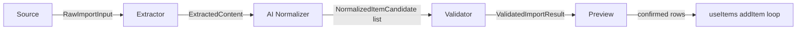

# Smart Import — Architecture (v2, approved)

Status: **Phase 1 and Phase 2 implemented.** This supersedes the original chat proposal — six changes were requested during Phase 1 review and are incorporated below. Anything not explicitly called out as "Phase 1: real" is a stub (valid interface, registered, `isAvailable()` → `false` or `throws not implemented`) per the original "infrastructure only" scope. Phase 2 (see its own section below) adds a real AI Analysis stage between Validator and Preview.

## Changes from the original proposal

1. **Entry point moved to the Lists screen** (`src/pages/Lists.tsx`), not `HeaderMenu2`.
2. **Import Preview** must support, per row: edit name, quantity, unit, category, notes, include/exclude.
3. **All future providers are shown in the UI**, unavailable ones rendered "Coming Soon" — never hidden.
4. **Pipeline replaced**: `Source → Parser` becomes `Source → Extractor → AI Normalizer → Validator → Preview`.
5. **`WhatsAppScreenshotSource` renamed to `ImageSource`** — a source describes the *input type* it produces, never the app it came from.
6. **The normalization stage is provider-agnostic** — its interface has no knowledge of any specific AI vendor. Phase 1 ships a non-AI, rule-based implementation of that same interface; a real AI-backed implementation is a Phase 2+ concern that must satisfy the identical contract.

## Why the pipeline change reshapes the source list

The original 10-item feature list ("Paste Text, AI Parsing, Image OCR, Camera, Gallery, CSV, Excel, Apple Reminders, Google Keep, WhatsApp screenshots") mixed two different concerns: *how input is obtained* and *how it's turned into structured data*. The new 5-stage pipeline separates them on purpose:

- **"AI Parsing"** was never really a Source — it's what the **AI Normalizer** stage does, for every source, uniformly.
- **"Image OCR"** was never really a separate Source either — OCR is what the **Extractor** stage does to an image, regardless of whether that image came from the camera, the gallery, or a shared screenshot.

So the *Source* list shrinks to genuine input channels — each one just answers "how did the user hand us something?" — while OCR/CSV-parsing/AI-normalization move to their proper pipeline stages:

| Original list item | Now lives as |
|---|---|
| Paste Text | Source: `paste-text` |
| Camera | Source: `camera` |
| Gallery | Source: `gallery` |
| WhatsApp screenshots | Source: `image` (renamed — see change #5; a shared screenshot is just one way to obtain an image, not a distinct input type from camera/gallery) |
| CSV | Source: `csv` |
| Excel | Source: `excel` |
| Apple Reminders | Source: `apple-reminders` |
| Google Keep | Source: `google-keep` |
| Image OCR | Extractor: `ocr` (shared by `camera`/`gallery`/`image` sources) |
| AI Parsing | The AI Normalizer stage itself (shared by every source) |

This is a direct payoff of decoupling Source from processing: three different acquisition UX flows (take a photo / pick from gallery / attach a saved screenshot) all produce the same shape of raw input (an image file) and can share one `OcrExtractor` — exactly the kind of reuse the pluggable pipeline is meant to enable, and exactly why `ImageSource` is named for what it *is* (an image) rather than where it came from.

## Pipeline



- **Source** — obtains raw input (`{ kind: 'text' }` or `{ kind: 'file' }`). Knows nothing about parsing.
- **Extractor** — turns raw input into flat text lines or tabular rows. Knows nothing about categories, AI, or validation. Picked by capability (`accepts(input)`), not by a hardcoded source→extractor map — so a source never needs to "know" its extractor.
- **AI Normalizer** — the *only* stage allowed to guess structure (name/quantity/unit/category/notes) from unstructured lines/rows. Provider-agnostic interface; Phase 1's implementation (`RuleBasedNormalizer`) does this with plain regex/string heuristics and **makes zero network calls** — deliberately, both to keep Phase 1 dependency-free and to prove the interface doesn't secretly require an AI vendor to function.
- **Validator** — required-field checks, in-list duplicate-name detection, quantity/unit sanity clamping. Produces `issues[]` (warnings/errors) alongside the final candidate list.
- **Preview** — UI only. Renders/edits `ValidatedImportResult.candidates`, then hands the user-confirmed subset back to `ImportService.commit()`.

## Interfaces

```typescript
// src/import/types.ts

export type ImportSourceId =
  | 'paste-text' | 'camera' | 'gallery' | 'image'
  | 'csv' | 'excel' | 'apple-reminders' | 'google-keep';

export type ExtractorId = 'plain-text' | 'ocr' | 'csv' | 'excel' | 'apple-reminders-export' | 'google-keep-export';

// Static metadata for the "show every provider, mark unavailable ones
// Coming Soon" requirement - one place that lists all 8 sources so the
// UI never needs its own hardcoded list.
export interface ImportSourceMeta {
  id: ImportSourceId;
  labelHe: string;
  labelEn: string;
  icon: string; // emoji, matching this app's existing icon convention (categoryStyles.ts)
}

export type RawImportInput =
  | { kind: 'text'; text: string }
  | { kind: 'file'; file: File };

export interface ImportSource {
  id: ImportSourceId;
  isAvailable(): boolean | Promise<boolean>;
  acquire(): Promise<RawImportInput>;
}

// Output of the Extractor stage - deliberately just two possible
// shapes (flat lines vs tabular rows), so every Normalizer only ever
// has to handle two cases regardless of how many Extractors exist.
export interface ExtractedContent {
  kind: 'lines' | 'rows';
  lines?: string[];
  rows?: string[][];
  warnings: string[];
}

export interface Extractor {
  id: ExtractorId;
  accepts(input: RawImportInput): boolean;
  extract(input: RawImportInput): Promise<ExtractedContent>;
}

// Shared context every pipeline run needs - existing categories (for
// categoryGuess matching) and existing item names (for the
// Validator's duplicate check). Assembled by ImportService from
// useCategories()/useItems(), passed down; neither Normalizer nor
// Validator ever imports those hooks directly (they're plain modules,
// not hooks).
export interface ImportPipelineContext {
  existingCategories: { id: string; name: string }[];
  existingItemNames: string[];
}

export interface NormalizedItemCandidate {
  id: string;
  rawText: string;
  name: string;
  quantity: number;
  unit: string | null;
  categoryGuess: { id: string; name: string; confidence: number } | null;
  notes: string | null;
}

// Provider-agnostic by construction: NO reference to Claude, OpenAI,
// or any vendor/model. Phase 1's only implementation
// (RuleBasedNormalizer) doesn't call any AI at all. A real AI-backed
// implementation later satisfies this exact same interface and is
// swapped in via registration - ImportService's orchestration code
// never changes to accommodate it.
export interface Normalizer {
  id: string; // e.g. 'rule-based' - never a vendor name
  normalize(content: ExtractedContent, context: ImportPipelineContext): Promise<NormalizedItemCandidate[]>;
}

export interface ValidationIssue {
  candidateId: string;
  field: 'name' | 'quantity' | 'unit' | 'category' | 'notes';
  message: string;
  severity: 'warning' | 'error';
}

// The shape ImportPreview actually renders and edits. Superset of
// NormalizedItemCandidate: adds `categoryId`/`categoryName` (resolved,
// editable choice - not just a guess) and `included` (the
// include/exclude toggle).
export interface ImportItemCandidate {
  id: string;
  rawText: string;
  name: string;
  quantity: number;
  unit: string | null;
  categoryId: string | null;
  categoryName: string | null;
  notes: string | null;
  included: boolean;
}

export interface ValidatedImportResult {
  sourceId: ImportSourceId;
  extractorId: ExtractorId;
  normalizerId: string;
  candidates: ImportItemCandidate[];
  issues: ValidationIssue[];
}

export interface Validator {
  id: string;
  validate(candidates: NormalizedItemCandidate[], context: ImportPipelineContext): Promise<ValidatedImportResult>;
}

export type AddItemFn = (
  name: string,
  categoryId: string | null,
  options?: { unit?: string | null; notes?: string | null }
) => Promise<boolean>;

export interface ImportService {
  listSources(): Promise<{ meta: ImportSourceMeta; available: boolean }[]>;
  runImport(sourceId: ImportSourceId, context: ImportPipelineContext): Promise<ValidatedImportResult>;
  commit(result: ValidatedImportResult, addItem: AddItemFn): Promise<{ committed: number; failed: number }>;
}
```

## Folder structure

```
src/import/
  index.ts                     # PUBLIC API - the only path anything outside src/import may use
  types.ts                     # interfaces above
  ImportService.ts             # orchestrator + registries (source/extractor/normalizer/validator)

  sources/
    PasteTextSource.ts          # Phase 1: real
    CameraSource.ts             # stub (isAvailable → false)
    GallerySource.ts            # stub
    ImageSource.ts              # stub (renamed from WhatsAppScreenshotSource)
    CsvSource.ts                # stub
    ExcelSource.ts              # stub
    AppleRemindersSource.ts     # stub
    GoogleKeepSource.ts         # stub
    metadata.ts                 # IMPORT_SOURCE_METADATA: ImportSourceMeta[] - drives the "show all, mark Coming Soon" UI
    registerSources.ts

  extractors/
    PlainTextExtractor.ts       # Phase 1: real
    OcrExtractor.ts             # stub - accepts() true for image-shaped input, extract() throws
    CsvExtractor.ts             # stub
    ExcelExtractor.ts           # stub
    AppleRemindersExtractor.ts  # stub
    GoogleKeepExtractor.ts      # stub
    registerExtractors.ts

  normalizers/
    RuleBasedNormalizer.ts      # Phase 1: real, non-AI, no network call
    registerNormalizers.ts

  validators/
    DefaultValidator.ts         # Phase 1: real
    registerValidators.ts

  ui/
    ImportEntryPoint.tsx         # button rendered in Lists.tsx, gated on featureFlags.enableExperimentalFeatures
    ImportSheet.tsx              # BottomSheet: lists ALL 8 sources; unavailable ones show a "Coming Soon" badge and are non-interactive
    ImportPreview.tsx
    ImportPreviewRow.tsx         # name / quantity / unit / category (reuses CategoryDropdown) / notes / include-exclude

  __tests__/
    ImportService.test.ts
    PasteTextSource.test.ts
    PlainTextExtractor.test.ts
    RuleBasedNormalizer.test.ts
    DefaultValidator.test.ts
```

## Entry point placement

`Lists.tsx` (the `/lists` management screen) gets a new button next to "create list", opening `ImportSheet`. Not `HeaderMenu2` — Import is conceptually "a way to populate a list," which is exactly what the Lists screen is already for, and it keeps `HeaderMenu2` unchanged. Gated on `featureFlags.enableExperimentalFeatures` (existing devtools flag, previously unused) — renders nothing when the flag is off, so this ships fully wired but invisible by default.

## Schema impact (new, scoped addition)

Supporting real unit/notes editing in Preview means those values must actually persist somewhere, not just live in the preview UI and get discarded on commit. `public.items` has no `unit`/`notes` columns today. This adds one small, additive migration:

```sql
alter table public.items
  add column if not exists unit text,
  add column if not exists notes text;
```

Nullable, no default-value backfill needed, zero behavior change for any existing row or call site. `useItems().addItem()` gains a **backward-compatible** optional third parameter (`{ unit?, notes? }`) — every existing call site (`ShoppingList.tsx`, `ItemCard`'s increment button) keeps working unchanged.

"Quantity" in Import deliberately reuses this app's *existing* convention (repeat-insert N times via the same `addItem` loop the quantity-stepper already uses) rather than adding a new persisted `quantity` column — consistent with the rest of the app, and avoids two competing "how many of this item" mechanisms.

## Component diagram

```
Lists.tsx
  └─ ImportEntryPoint.tsx  (gated: featureFlags.enableExperimentalFeatures)
        │
        ▼
     ImportSheet.tsx  (wraps <BottomSheet>)
        │  lists all 8 sources via IMPORT_SOURCE_METADATA;
        │  only "Paste Text" is enabled, the other 7 show a
        │  "Coming Soon" badge and are non-interactive
        │
        ▼ (Paste Text selected + submitted)
     ImportService.runImport('paste-text', context)
        │   PasteTextSource.acquire()
        │     → PlainTextExtractor.extract()
        │       → RuleBasedNormalizer.normalize()
        │         → DefaultValidator.validate()
        ▼
     ImportPreview.tsx  (renders ValidatedImportResult.candidates)
        │
        ├── ImportPreviewRow.tsx × N
        │     ├── name (text input)
        │     ├── quantity (reuses <QuantityStepper>)
        │     ├── unit (text input)
        │     ├── category (reuses <CategoryDropdown>)
        │     ├── notes (text input)
        │     └── included (checkbox)
        │
        ▼ (confirm)
     ImportService.commit(result, useItems().addItem)
        │
        ▼
     addItem(name, categoryId, { unit, notes }) × (included count, × quantity each)
        │
        ▼
     Existing Realtime subscription re-renders ShoppingList.tsx - no
     special "just imported" code path needed downstream.
```

## Implementation plan (Phase 1)

| # | Task | Real or stub |
|---|---|---|
| 1 | `types.ts` | — |
| 2 | Migration: `items.unit`, `items.notes` | real |
| 3 | Extend `useItems().addItem` | real |
| 4 | `ImportService.ts` (registries + orchestration, capability-based extractor matching) | real |
| 5 | `sources/PasteTextSource.ts` | real |
| 6 | `sources/{Camera,Gallery,Image,Csv,Excel,AppleReminders,GoogleKeep}Source.ts` + `metadata.ts` | stub |
| 7 | `extractors/PlainTextExtractor.ts` | real |
| 8 | `extractors/{Ocr,Csv,Excel,AppleReminders,GoogleKeep}Extractor.ts` | stub |
| 9 | `normalizers/RuleBasedNormalizer.ts` | real (non-AI) |
| 10 | `validators/DefaultValidator.ts` | real |
| 11 | `ui/{ImportEntryPoint,ImportSheet,ImportPreview,ImportPreviewRow}.tsx` | real |
| 12 | Wire into `Lists.tsx` | real |
| 13 | Unit tests (Vitest, first in this repo) for items 4, 5, 7, 9, 10 | real |
| 14 | One Playwright e2e smoke test (flag on → paste → preview edit → confirm → item appears) | real |

## Risk assessment

| Risk | Level | Notes |
|---|---|---|
| Schema change (unit/notes columns) touches a stable, well-tested hook | **LOW** | Additive/nullable, backward-compatible optional param, no existing call site changes required. |
| "Show all 8, mark 7 Coming Soon" invites users to try something that doesn't work | **LOW** | Disabled state is non-interactive by construction (`isAvailable() === false` sources aren't selectable in `ImportSheet`), not just visually greyed out. |
| Capability-based extractor matching (`accepts()`) picks the wrong extractor if two ever overlap | **LOW** | Only one real Extractor exists in Phase 1; stub extractors' `accepts()` is scoped narrowly (by `RawImportInput.kind` combined with expected MIME/file type later) to avoid ambiguity as more are implemented. |
| Provider-agnostic Normalizer interface still ends up quietly shaped around one vendor's response format when a real AI implementation is added later | **MEDIUM** | Out of scope for Phase 1 (no AI implementation exists yet), but worth a deliberate design review *when* Phase 2 adds the first real AI-backed `Normalizer`, specifically checking it doesn't leak vendor-specific fields into `NormalizedItemCandidate`. |
| Rule-based normalizer's quantity/unit parsing is naive (regex) and misparses real-world pasted text | **MEDIUM** | Acceptable for Phase 1 - Preview lets the user correct every field before commit, so a wrong guess is a minor edit, not a silent data error. |
| Vitest introduction adds new tooling/CI surface | **LOW** | Additive devDependency + one new script; existing Playwright/tsc/lint/build steps are untouched. |
| Image/Camera/Gallery sources still have no Supabase Storage backing | **MEDIUM** | Unchanged from the original assessment - not a Phase 1 blocker since these remain stubs; flagged again here so it isn't lost. |

## Phase 2 (implemented): AI Analysis stage

Pipeline is now: `Source → Extractor → Rule-Based Normalizer → Validator → AI Analysis → Preview → Import`. Inserted after Validator, before the result is returned to the UI - no change to `Source`/`Extractor`/`Normalizer`/`Validator` interfaces, and no restructuring of Preview's existing editable fields (only additive display of AI-enriched data, per the approved scope).

### `TextUnderstandingEngine` - the provider-agnostic AI interface

```typescript
export interface TextUnderstandingEngine {
  id: string; // e.g. 'heuristic' - deliberately never a vendor name
  isAvailable(): boolean | Promise<boolean>;
  analyze(candidates: ImportItemCandidate[], context: ImportPipelineContext): Promise<AiAnalysisResult>;
}
```

Same discipline as `Normalizer`: nothing in this interface, or in `ImportService`, or in the UI, references Claude, OpenAI, Gemini, Ollama, Azure OpenAI, or any other vendor. Phase 2's only implementation (`HeuristicTextUnderstandingEngine`) makes no network call at all - a future vendor-backed implementation is added purely by registering a second engine in `src/import/ai/registerAiEngines.ts`.

### What `HeuristicTextUnderstandingEngine` genuinely does

Real, deterministic, plain-string-algorithm heuristics - not a fabricated "AI":

- **Name tidy-up** (high confidence): strips stray whitespace/punctuation. Meaning-preserving, so it's safe to auto-apply.
- **Category suggestion** (medium confidence): word-token overlap with existing categories - a real improvement over the Rule-Based Normalizer's plain substring check (e.g. category "מוצרי חלב" now matches an item named "חלב 3%", which the substring check misses).
- **Unit inference** (low confidence): a small keyword lookup (`commonUnits.ts`) for common grocery items missing a unit. Low confidence because it's a guess about the *product*, not derived from what the user actually typed - never auto-applied.
- **Ambiguous-item flagging**: names with no real letters or too short to mean anything.
- **Duplicate/near-duplicate detection**: within the same import batch only (the list's own existing-item duplicate check already lives in `DefaultValidator`), via edit distance. Always a suggestion (`aiDuplicateOfCandidateId` + a merge action in Preview) - **never an automatic merge**.

### What it deliberately does not do

Two of the nine responsibilities in the brief - **real spelling correction** and **generating a genuinely useful note** - require actual language understanding. A heuristic can't do either honestly without fabricating output that looks smarter than it is, so neither is implemented here. Both are left for a real AI-backed engine to implement against the exact same `TextUnderstandingEngine` interface; nothing about the interface, the confidence rule, or the Preview UI needs to change when that happens.

### Confidence rule (as implemented in `applyAiEnrichments`)

| Confidence | Behavior |
|---|---|
| High | Field is populated directly. Preview shows a quiet "✨" badge. |
| Medium | Field is also populated directly, but Preview's badge is visually stronger (highlighted) - a nudge to double-check, not a demand. |
| Low | The real field is **never** touched. The suggested value lives in a separate `aiPending*` field until the user taps "apply" in Preview - copying it in only then. |

### Error handling

An absent, unavailable, or throwing AI engine is a normal, fully-supported outcome, not an error: `ImportService.runImport` catches any failure from the AI Analysis stage and simply returns the Validator's own output untouched (`aiEngineId` stays `undefined`). The import flow is never blocked waiting on or failing because of AI. Verified directly with a test that mocks the engine registry to simulate both an unavailable engine and one that throws.

### UX

`ImportSheet` gets a dedicated "analyzing" step (spinner + "מנתח את רשימת הקניות שלך...") shown while `runImport` (now including the AI stage) is in flight, replacing what was previously just a disabled button label.

## Phase 2A (implemented): compact review UI, then a single shared editor

Phase 2A first redesigned `ImportPreviewRow` into a compact row (~64px) with an inline expandable editor per row - collapsed rows stayed mounted (`inert`) so the CSS `grid-template-rows` transition had real content to animate to. A follow-up architecture pass replaced that per-row editor with **one shared `ImportItemEditor` instance**:

- `ImportPreviewRow` renders the compact row only - no editor content, no per-row state, no `inert`/animation machinery.
- `ImportPreview` holds `selectedCandidateId: string | null`. When set, it renders `ImportItemEditor` for that one candidate **in place of** the row list (not alongside it); when `null`, it renders the row list as before.
- Selecting a row sets `selectedCandidateId`; the editor's close button clears it, returning to the compact list.
- Saving a field calls the same `onUpdateCandidate` callback as before - editor and row list both ultimately funnel through `ImportSheet`'s single `candidates` state, unchanged from the prior commit.

This is a real DOM-size reduction: previously an import of 30-50 items mounted 30-50 full editors (every input, every AI indicator, every button) simultaneously, all but one `inert`. Now at most one editor's worth of DOM exists at any time, regardless of list size - and any future AI feature that needs to hook into "the item currently being edited" (Phase 2B+) has exactly one call site to extend, not N.

No change to `ImportService`, the pipeline, any provider, `useItems`/`useCategories`, or `ImportSheet`'s state-lifting/sticky-footer wiring from the previous pass - this is a pure Preview-UI restructuring.

## Phase 2B (implemented): Knowledge Base & deterministic Semantic Analysis

A non-AI understanding layer, built and fully verified *before* any real AI/OCR/vendor integration - no network call, no Claude/OpenAI/Gemini/OCR SDK anywhere in this phase. Recognizes common grocery products, quantities, units, and categories from plain text using a static, in-memory knowledge base plus deterministic parsing.

### `src/import/knowledge/` - the single source of truth

```
src/import/knowledge/
  categories.ts    KNOWLEDGE_CATEGORIES - re-lists theme/categoryStyles.ts's real category
                   names as this module's own literal union, with zero import from the
                   theme layer (pure data, must never need to change if styling does)
  units.ts         UNIT_SYNONYMS + normalizeUnit() - whole-token unit normalization
                   (קילו/ק"ג/קילוגרם -> ק"ג, גר/גרם -> גרם, יח/יחידה -> יח', ל/ליטר -> ליטר, ...)
  aliases.ts       REQUIRED_ABBREVIATION_ALIASES - the 4 spec-mandated abbreviations
                   (תפ"א, מלפ', עגב', נס), kept separate so they stay grep-able
  brands.ts        KNOWLEDGE_BRANDS - brand names (תנובה, טרה) x product id combos;
                   KnowledgeBase.ts generates one alias per combo at load time (e.g.
                   "חלב תנובה") instead of hand-writing every combination in products.ts
  products.ts      KNOWLEDGE_PRODUCTS - ~17 entries (id, canonicalName, aliases, category,
                   defaultUnit, optional brand/keywords). Rice/pasta were considered and
                   dropped - neither maps cleanly onto any existing category, and guessing
                   one would mean inventing a category placement
  KnowledgeBase.ts Facade built ONCE at module load: a productById Map and an aliasIndex
                   Map (canonical names + aliases + generated brand combos), never
                   re-scanned per call
  KnowledgeMatcher.ts  matchProduct(rawName, context) - the 5-tier resolution below
  index.ts         Public barrel - every current and future import source (AI, OCR,
                   Camera, Gallery, WhatsApp, Apple Notes/Reminders, CSV, Excel) is
                   expected to import from here rather than hardcoding grocery knowledge
```

### Category resolution priority (`KnowledgeMatcher.matchProduct`)

1. **Exact product match** - the normalized input equals a product's own canonical name exactly.
2. **Alias match** - equals one of that product's aliases (including a brand-combo alias), or is one of the 4 required abbreviations. Confidence for a resulting rename: **high**.
3. **Keyword match** - either a single whole *token* of the input is itself an exact product/alias match (e.g. "חלב" inside "חלב 3%"), or the input contains one of a product's `keywords` substrings (e.g. "עגבני" catches "עגבניה"/"עגבנייה"/"עגבניות" without enumerating every inflection). **Never renames the name** - a partial/token match isn't a strong enough signal to rewrite the whole name field (this is what keeps Phase 2's own "עגבניה"/"עגבניות" duplicate-suggestion test passing unchanged: neither gets renamed, so the Heuristic engine's duplicate detector still compares the same two original strings it always did).
4. **Existing-category match** - independent of the product list entirely: the input textually contains one of *this user's own real* category names.
5. **Fuzzy match** - Levenshtein distance ≤ 2 against any known canonical name/alias (strings under 4 characters are excluded, mirroring `HeuristicTextUnderstandingEngine`'s own duplicate-detection guard). The weakest signal - both a resulting rename and category are **low** confidence.
6. **None** - nothing recognized. Category and name are left untouched; **a category is never invented**.

Category confidence is deliberately capped at **medium**, even for an exact product match - a category is a judgment call (the same product can reasonably belong to more than one store section), so this module never claims "high" for it. Only quantity/unit values parsed directly out of the raw text itself (not a knowledge-base guess) warrant "high".

### `parseQuantity` - the quantity/unit parser (`src/import/semantic/parseQuantity.ts`)

Recognizes all 9 required formats (`"3 מלפפון"`, `"מלפפון 3"`, `"3x מלפפון"`, `"מלפפון x3"`, `"מלפפון ×3"`, `"2 יח מלפפון"`, `"500 גרם גבינה"`, `'2 ק"ג תפוחים'`, `"1.5 ליטר חלב"`), returning the quantity, unit (if present), and the remaining product-name text.

Deliberately **not** one monolithic regex - two bugs were found and designed around before writing any code:

1. A single regex with an optional unit group between two whitespace-consuming pieces can fail to match a leading bare quantity with no unit at all - the leading `\s*` greedily consumes the only space, leaving nothing for a later mandatory `\s+`.
2. Matching a unit via regex alternation risks a short synonym partial-matching inside an unrelated word - e.g. "מל" (מ"ל/milliliter) is a literal prefix of "מלפפון" (cucumber).

Both are avoided by splitting the line into whitespace-separated tokens and checking a unit synonym only as a **whole token** via `normalizeUnit()`, never as a substring - the same discipline `RuleBasedNormalizer`'s own Hebrew-`\b` fix (Phase 1) established, applied one level further.

### `SemanticAnalyzer` - wiring into the pipeline

Pipeline is now: `Source → Extractor → Rule-Based Normalizer → Validator → Semantic Analysis → AI Analysis → Preview → Import`.

The originally-sketched diagram (`... → Knowledge Matcher → Semantic Analyzer → Rule-Based Normalizer → ...`) implied semantic understanding happens *before* normalization. The actual wiring runs it *after* `Validator`, in parallel with (immediately before) the existing AI Analysis stage instead - re-parsing each candidate's original `rawText` rather than `RuleBasedNormalizer`'s already-processed `name`, which is what lets it recognize formats `RuleBasedNormalizer`'s narrower regexes miss (e.g. a trailing bare quantity) without modifying `RuleBasedNormalizer` at all. This is a deliberate, documented trade-off to honor the "do not change `RuleBasedNormalizer`/`Validator`" constraint - the net effect on recognized formats is identical either way.

Applied via the **exact same `applyAiEnrichments()` merge function** Phase 2's AI Analysis stage already uses, and producing the exact same `AiItemEnrichment` shape - so Semantic Analysis's results appear in Preview through the same badges/pending-suggestion UI with **zero Preview code changes**. Because it runs first, `HeuristicTextUnderstandingEngine`'s existing guards (`if (!candidate.unit)`, `if (!candidate.categoryId)`) naturally skip any field Semantic Analysis already resolved - the two stages never fight over the same field, with no new coordination logic needed.

A rename is only ever proposed when a match's tier is `exact-product`, `alias`, or `fuzzy` **and** the canonical name actually differs from the candidate's current name - not whenever the *matched product portion* happens to already be canonical. These are different questions: `RuleBasedNormalizer` fails to strip a trailing bare quantity (a format only `parseQuantity` recognizes), so `"מלפפון 3"` reaches this stage as the candidate name `"מלפפון 3"` in full, even though the product portion (`"מלפפון"`) is already an exact match. Gating the rename on "already canonical" alone (an earlier draft of this logic) would have silently left the stray `"3"` in the name - caught during e2e testing, not by any unit test, since the unit test had unrealistically pre-cleaned the candidate's name.

Both this stage and the AI Analysis stage below it are wrapped in their own try/catch - a throw in either must never block the import flow, matching Phase 2's existing fail-safe discipline. Semantic Analysis never calls Claude/OpenAI/Gemini/OCR or any network API; every answer comes from `parseQuantity.ts` (regex/tokenization) and the knowledge base (a static, in-memory lookup, loaded once).

### `categoryId` vs `categoryName` - a documented trade-off

`KnowledgeMatcher` resolves a `categoryName` string whenever a product is recognized, independent of any one user's real categories. The real, attachable `categoryId` is only set if a category with that exact name already exists in `context.existingCategories` (case-insensitive) - otherwise it stays `null`, even though `categoryName` (and the badge) still display. This means a suggested category can be visible in Preview without being committable as-is; creating a new category row on the user's behalf is out of scope for this phase (it touches business logic Phase 2B is explicitly not allowed to change). The user can still pick a real category manually in the editor before confirming.

### Tests

- `src/import/knowledge/__tests__/KnowledgeMatcher.test.ts` (16 tests) - canonicalization, aliases (including the 4 required abbreviations and generated brand combos), keyword-tier non-renaming, category-resolution priority (including "never invents a category"), and confidence (never numeric, category capped at medium).
- `src/import/semantic/__tests__/parseQuantity.test.ts` (12 tests) - all 9 required formats, plus no-quantity and prefix-ambiguity regression guards.
- `src/import/semantic/__tests__/SemanticAnalyzer.test.ts` (9 tests) - the 5 scenarios required by the spec, "never re-suggest an already-correct field," and the low-confidence unit fallback.
- `e2e/smart-import-semantic.spec.ts` - all 5 required scenarios end-to-end through the real Preview UI, in a file of its own so Phase 2/2A's existing e2e coverage (AI Analysis badges, the single shared editor) stays untouched and provably unaffected.

### Validation

TypeScript, production build, lint, all 88 Vitest unit tests, and the full Playwright e2e suite (including Phase 1/2/2A's pre-existing specs) all pass with this change. Two pre-existing unit test assertions were updated (not reverted) because the new behavior they exercise is legitimately different and spec-required: `"2x milk\nbread"` now canonicalizes to `["חלב", "לחם"]` (Semantic Analysis's job), and a failing AI engine no longer implies untouched `aiSuggestions` (Semantic Analysis is an independent stage that still ran).

## Phase 2C (implemented): real AI Assistant + User Learning

The first real AI/vendor integration in Smart Import - everything before this phase (Semantic Analysis, the retired Heuristic engine) was deliberately non-AI. The AI is an *assistant*, not the primary parser: Rule-Based Normalizer + Semantic Analysis still run first and resolve the large majority of items on their own; the AI Assistant only ever sees what's left unresolved.

### Architecture

```
React App -> ImportService -> Supabase Edge Function -> Claude API
                                     -> Structured JSON -> Preview
```

The client **never** calls Claude directly, and `ANTHROPIC_API_KEY` **never** exists anywhere in the frontend bundle - only in the Edge Function's own environment (a Supabase secret, provisioned once outside CI - see "Deployment" below).

### Pipeline

```
Source -> Extractor -> Rule-Based Normalizer -> Validator ->
Semantic Analysis -> Local Batch Heuristics -> User Learning Lookup ->
AI Assistant (unresolved items only) -> Preview -> User edits ->
Save Learning
```

Inserted into `ImportService.runImport()` in this exact order, right after Semantic Analysis:

1. **Local Batch Heuristics** (`src/import/local/BatchHeuristics.ts`) - ambiguous-name flagging and within-batch duplicate detection, extracted **verbatim** from the retired Heuristic engine. Always runs, no network - these two checks were never really "AI" (no vendor, no model), and the Phase 2C AI response schema doesn't include either field, so they keep running independently of Learning/AI Assistant rather than being folded into either.
2. **User Learning Lookup** (`src/import/learning/`) - a single batched query (`.in('original_text', [...])`) against `user_import_learning`, keyed by normalized text, with an in-memory cache so a repeated phrase within one session never re-queries. A hit is applied at **high** confidence (it's the user's own explicit past correction) and - critically - marks that candidate as "skip AI" **unconditionally**, even if the correction only ever addressed one field (e.g. category) and left another (e.g. unit) untouched. Re-sending an item to AI just because one other field is still empty would defeat the entire point of having learned from it once already.
3. **AI Assistant** (`src/import/ai-assistant/`) - only candidates still unresolved after step 2, batched into **one** request (never one call per item). "Unresolved" (`isUnresolved.ts`) means: no category, no unit, flagged ambiguous, or carrying any low-confidence pending suggestion - matching the spec's own listed examples. "Missing quantity" is deliberately not modeled as its own signal: Normalizer + Semantic Analysis always resolve a valid quantity (defaulting to 1), so there's no honest "unknown quantity" state distinct from "quantity 1" to detect.

Every one of these four stages (including AI Assistant) is wrapped in its own try/catch and merges via the **exact same `applyAiEnrichments()`** function Phase 2 established - so results from Learning and the AI Assistant appear in Preview through the same badges/pending-suggestion UI with **zero Preview code changes**, and a failure at any stage just means the pipeline falls back to whatever it already had, never blocking the import.

### Provider-agnostic on both sides of the network boundary

Two independent interfaces, split exactly at the client/server boundary the security requirement creates:

- **Client-side** (`src/import/ai-assistant/types.ts`): `AiAssistantProvider` - `ImportService` only ever knows it's calling "the AI Assistant provider". `SupabaseEdgeFunctionAiProvider` (the only implementation) calls `supabase.functions.invoke('import-ai-assistant', ...)` - no vendor name appears anywhere client-side.
- **Server-side** (`supabase/functions/import-ai-assistant/providers/AiProvider.ts`, Deno): a second `AiProvider` interface - `ClaudeProvider` is the only implementation today. Swapping Claude for OpenAI/Gemini means adding one new provider file server-side and changing which one `index.ts` registers - **zero changes to `index.ts`'s request handling, `ImportService`, or the frontend**.

### The Edge Function (`supabase/functions/import-ai-assistant/`)

- **Authenticates**: relies on Supabase's platform-level JWT verification (`verify_jwt = true` in `config.toml`, explicit rather than left to the CLI default) plus an explicit in-function check that a request has an `Authorization` header at all.
- **Validates the payload** (`schema.ts`'s `isValidAiAssistantRequest`): language, an exact category list, 1-50 well-formed unresolved items.
- **Builds the prompt** (`prompt.ts`): system prompt includes the *exact* category list ("never invent a new one") and instructs the model to respond only via a forced tool call.
- **Calls Claude via tool-forcing**, not a text reply parsed as JSON - `tool_choice: { type: 'tool', name: 'submit_import_analysis' }` on the Anthropic Messages API is what actually *guarantees* structured output, rather than merely requesting it in a prompt.
- **Re-validates every returned field** (`schema.ts`'s `sanitizeSuggestion`) against what was actually sent in the request: an unknown `candidateId`, a category not in the exact list, a missing/invalid confidence level (never numeric), or a wrong value type are all silently dropped rather than trusted. This is what "the AI must never invent unsupported fields" means in code, not just in the prompt.
- **Never returns free text** - every response (success or failure) is JSON, including errors.

Deliberately kept **stateless** - no database access. `user_import_learning` reads/writes stay entirely client-side (RLS already scopes them per-user), which keeps the function's blast radius to exactly one job: talk to the AI provider and validate its output.

### Confidence rule (unchanged, reused)

| Source | Confidence | Why |
|---|---|---|
| Quantity/unit parsed directly from the raw text (Semantic Analysis) | High | Not a guess - it's what the user actually typed. |
| A learned correction (User Learning) | High | The user's own explicit, past decision. |
| AI Assistant's canonical-name / alias-tier rename | High or Low (per the model's own confidence) | Re-validated, never trusted blindly. |
| Category, from any source | Never High | A category is a judgment call - see Phase 2B's own reasoning, unchanged and still followed here. |

### Database: `user_import_learning`

`id, user_id, original_text (normalized), normalized_name, category_id, unit, quantity, updated_at`, unique on `(user_id, original_text)`, RLS scoped to `auth.uid() = user_id` (same pattern as the existing `history` table). `quantity` is an addition beyond the spec's own "suggested fields" list - STEP5 explicitly requires learning from quantity corrections too, which the suggested schema didn't have a column for.

Stores **only** corrections the user actually made - `ImportService.saveLearning()` diffs the pipeline's pre-edit output against what the user confirmed and writes only the fields that differ; a row the user accepted as-is is never written.

### Deployment

`ANTHROPIC_API_KEY` must be provisioned **manually**, once, directly against each Supabase project (`supabase secrets set ANTHROPIC_API_KEY=... --project-ref ...`) - deliberately never touched by CI or stored as a GitHub Actions secret, so it can never leak into a workflow log. Until it's set, the deployed function responds with a clear `500` rather than silently doing nothing. `.github/workflows/supabase-migrations.yml` now also deploys `supabase/functions/import-ai-assistant` to the production/dev projects alongside migrations, on the same trigger paths.

### Retired in this phase

`HeuristicTextUnderstandingEngine`, `registerAiEngines.ts`, `commonUnits.ts`, and the `TextUnderstandingEngine`/`AiAnalysisResult` interfaces - their category/unit/name guessing was strictly redundant with Semantic Analysis's knowledge-base lookup (a genuine improvement over word-token overlap and a 17-keyword table). Only the two checks that were never really "AI" (ambiguous-flagging, duplicate-detection) survive, relocated to `local/BatchHeuristics.ts`.

### Tests

- `supabase/functions/import-ai-assistant/__tests__/`: `schema.test.ts` (15), `ClaudeProvider.test.ts` (5), `index.test.ts` (8) - request handling, validation, and the Claude provider are all Deno-API-free by construction, so they run directly under the app's existing Vitest setup.
- `src/import/learning/__tests__/LearningRepository.test.ts` (7) - batching, caching (both hits and misses), upsert shape.
- `src/import/local/__tests__/BatchHeuristics.test.ts` (7) - ported from the retired engine's own tests.
- `src/import/__tests__/ImportService.ai-assistant.test.ts` (7) - the exact STEP9 scenarios: learning hit skips AI, learning miss calls AI batched, provider timeout/Edge-Function-failure/no-provider-registered all fail safely, successful enrichment merges correctly.
- `e2e/smart-import-ai-assistant.spec.ts` (3) - the full 3-import "קישוא" flow through the real UI: AI resolves it and the user accepts as-is (nothing saved); the user corrects the AI's suggestion (correction saved, with the right `category_id`); a later import of the same text resolves from the learning table alone, with the AI Assistant **never called** (asserted directly against the mocked route).

### Validation

TypeScript, production build, lint, all 125 Vitest unit/integration tests, and the full Playwright e2e suite (all pre-existing specs, unchanged, plus the 3 new ones) all pass. `e2e/fixtures.ts`'s `mockListData()` now also mocks `user_import_learning` and the `import-ai-assistant` function (defaulted to "no saved corrections" / "call succeeds with no suggestions"), so every pre-existing Smart Import test keeps observing the same `aiEngineId`-gated summary UI as before the AI stage was replaced, without any of those tests needing to know either endpoint exists.

## Phase 2C review & refactor (implemented): stabilization, no new features

A pure architecture review of everything Phase 2C added - no new capability, no UI change. Findings and changes:

- **`ImportService.runImport` de-duplicated**: the three near-identical try/catch/`console.error` blocks around Semantic Analysis, Local Batch Heuristics, and Learning Lookup were collapsed into one `safelyEnrich()` helper (compute enrichments → merge via `applyAiEnrichments` → never let a failure block the import). Same behavior, ~40 fewer lines, one place to read the fail-safe contract instead of three.
- **Learning saves batched**: `LearningRepository.saveCorrection` (one row, one round-trip) became `saveCorrections` (many rows, one round-trip) - correcting several items in a single import previously meant one sequential `upsert` per row; now it's a single bulk `upsert`. `ImportService.saveLearning` collects every diffed correction first, then sends one batched call.
- **`ClaudeProvider` gets one bounded retry**: network errors, `429`, and `5xx` responses are retried exactly once (with a short delay) before giving up - a `4xx` is never retried, since it would just fail identically again. This is reliability, not a new capability: the success-path contract is unchanged, and `ImportService`'s existing fail-safe handling is what still runs if both attempts fail.
- **Edge Function**: the Claude provider is now constructed once at startup instead of on every incoming request (`apiKey`/`model` never change between requests).
- **Minor DRY**: `learning/buildEnrichments.ts`'s four repeated `'From your past correction'` literals became one constant; `isUnresolved.ts`'s doc comment now explains precisely why it doesn't check `aiPendingQuantity` (nothing upstream of it can ever set that field - not merely "quantity is never unresolvable").
- **Dead code**: none found beyond what the wiring commit already removed (`HeuristicTextUnderstandingEngine`, `registerAiEngines.ts`, `commonUnits.ts`, `TextUnderstandingEngine`/`AiAnalysisResult`). Every exported type/function in `src/import/` and `supabase/functions/import-ai-assistant/` was traced to a real call site or test.
- **Considered and deliberately left alone**: merging Semantic Analysis + Local Batch Heuristics into one `applyAiEnrichments` pass (would blur two intentionally distinct responsibilities for a save of a handful of array traversals at typical list sizes - not worth it); merging `learning/buildEnrichments.ts` and `ai-assistant/buildEnrichments.ts` (structurally similar, but the confidence/category-resolution rules genuinely differ per source); `KnowledgeMatcher`'s fuzzy-match tier scanning all ~17 products (negligible at this scale; worth revisiting only if the knowledge base grows an order of magnitude).
- **Flagged, not implemented** (would be new infrastructure, out of scope for a no-new-features review): per-user rate limiting on the Edge Function (would need persistent request-count state the function doesn't have); restricting `Access-Control-Allow-Origin` from `*` to an explicit origin allowlist (safe today since `verify_jwt` already gates every request, but worth tightening once the app's deployed origins are finalized).

Validation: tsc/build/lint clean, 138 Vitest tests pass (12 new: retry behavior, batched-save behavior, `saveLearning` diff logic in isolation), full Playwright suite passes (all Smart Import specs; one unrelated pre-existing swipe-gesture flake, confirmed by isolated re-run, in `dev-settings.spec.ts` - touches no file this review changed).

## Final import commit fixes (implemented)

Two remaining correctness gaps, found only after the Phase 2C review, both at the very end of the pipeline.

### 1. A quantity could survive inside the stored name for an unrecognized product

`SemanticAnalyzer`'s rename logic (Phase 2B) only replaced `candidate.name` with a *canonical* name when the knowledge base actually recognized the product (`exact-product`/`alias`/`fuzzy` tiers). For a product the knowledge base has never heard of - e.g. "קישוא" (zucchini), deliberately absent from `knowledge/products.ts` - `matchProduct` returns tier `'none'`, so no rename ever fired, even though `parseQuantity` had *already* correctly identified and stripped a quantity/unit. The net effect: "קישוא 3" would resolve to quantity 3 correctly, but the stored `name` stayed the dirty, unstripped "קישוא 3" - the exact defect "the stored item name must never contain embedded quantity values" describes.

Fixed in `SemanticAnalyzer.analyzeCandidate`: when no knowledge-base match justifies a full canonicalization, but `parseQuantity` genuinely found and stripped a quantity/unit token (`parsed.quantityFound || parsed.unitFound`), the merely-cleaned (quantity/unit removed, whitespace-normalized) text is still proposed as a high-confidence rename - not a guess about what the product *is*, just a mechanical fact about what's left over after removing tokens already found. Gated specifically on `quantityFound`/`unitFound` (not "does the cleaned text merely differ from the name") so it can never fire when nothing was actually parsed - protecting a case like `RuleBasedNormalizer` already having split off a trailing " - notes" suffix, which `SemanticAnalyzer` re-parses from the full original `rawText` and must not reintroduce into `name`.

`parseQuantity.ts` also now collapses internal whitespace once, up front (`rawText.trim().replace(/\s+/g, ' ')`), so every exit path's `remainingText` is consistently normalized rather than only trimmed at the edges.

### 2. Importing a product already on the list created a second, duplicate-looking group

This app has no persisted `quantity` column - "Nx" is purely a *display* convention (`ShoppingList.tsx`'s `clusterByName`, grouping items by **exact name string, within a category section**). `ImportService.commit()` already represented quantity correctly (N inserted rows), but it had no way to make those new rows join an *existing* item's group: if the existing "קישוא" was stored under a different category than what Smart Import guessed (or the import's freshly-canonicalized name differed even trivially from what's already stored), the newly-inserted rows would render as a **second**, differently-styled cluster - a real, visible duplicate.

Fixed by giving `commit()` an additional, optional `existingItems` parameter (`ExistingItemForMerge[]` - a minimal plain-data projection of `useItems().items`, never the hook itself). Before inserting a candidate's rows, `commit()` looks for an existing **active** (`!isDone`) item whose name matches the candidate's *final* name (after Preview edits) once normalized; if found, the new rows are inserted using that item's **exact** stored name and its category/unit/notes - never the candidate's own guessed values - so they provably join its existing group instead of starting a new one. No existing row is ever read from again or modified; this only changes which name/metadata the *new* rows are inserted with. A completed (`isDone: true`) item is never a merge target - the user is about to buy the imported item, not the one they already checked off.

`ImportSheet.tsx` passes `useItems().items` (mapped to the minimal shape) into `commit()`; a caller that omits `existingItems` gets the previous always-insert-new-rows behavior unchanged.

### Tests

- `SemanticAnalyzer.test.ts`: "קישוא 3"/"3 קישוא" name cleanup, whitespace collapsing, no-op when nothing was parsed, and the notes-suffix regression guard.
- `ImportService.test.ts`: a new `describe` block covering merge-found (exact name/category/unit/notes reused), case/whitespace-insensitive matching, no-match (creates normally), completed-item exclusion, edited-quantity-is-what's-used, and two candidates merging into the same existing item without ever diverging into two groups.
- `e2e/smart-import-merge.spec.ts` (4 tests): the exact scenarios above, verified against the real Preview UI and the real grouped `/` list view (not just `ImportService` in isolation) - including polling the mocked `items` array (fed back into the GET response so a post-import page reload reflects the newly inserted rows) to confirm the resulting group shows "5x", not a duplicate "קישoא" text node.

### Validation

tsc/build/lint clean. 149 Vitest tests pass (14 new). Full Playwright suite passes, including all 13 Smart Import specs (9 pre-existing, unchanged, + 4 new).

## Future enhancement (not part of Phase 1): optional AI Review stage

**Not implemented. Not scheduled. This section exists only to confirm the Phase 1 architecture reserves room for it, so adding it later doesn't force a redesign.**

A future phase may insert an optional review step between Preview and the actual commit:

```
Source → Extractor → Rule-Based Normalizer → Validator → AI Analysis → Preview → AI Review (Optional) → Import
```

Where today's flow goes straight from Preview's confirm action to `ImportService.commit()`, this stage would sit in between: it takes the user's already-edited candidate list (post-Preview, pre-commit) and looks at it *as a whole* rather than row-by-row, to support things like:

- Merging duplicate items
- Detecting similar products
- Normalizing quantities and units across rows
- Correcting spelling mistakes
- Suggesting better categories
- Suggesting complementary shopping items
- Highlighting ambiguous items for the user to confirm before they're actually added

### Why this doesn't require major refactoring

This capability is deliberately *not* the same thing as the AI Normalizer stage: Normalizer only ever sees one Extractor's output in isolation, before the user has edited anything; AI Review would see the whole, user-confirmed candidate list at once, which is a distinct concern - so it's designed as its own stage rather than folded into Normalizer's job. Concretely, adding it later means:

- **A new pluggable interface, not a change to any existing one.** A `Reviewer` interface (`id` + one method, e.g. `review(candidates: ImportItemCandidate[], context): Promise<ReviewedImportResult>`) would be added to `types.ts` and registered via `src/import/reviewers/registerReviewers.ts` - the exact same shape and pattern already used for `Normalizer` and `Validator`. No existing interface (`ImportSource`, `Extractor`, `Normalizer`, `Validator`) needs to change.
- **`ImportItemCandidate` doesn't need a new shape.** AI Review would operate on and return the same candidate shape Preview already edits and `commit()` already consumes - no new type needs to be threaded through the earlier stages.
- **One additive method on `ImportService`**, e.g. `review(...)`, alongside the existing `runImport`/`commit` - not a change to either of their signatures.
- **One additive step in `ImportSheet`'s local state machine.** Today's `Step` type (`'source' | 'preview'`) gains a `'review'` value; `handleConfirm` (currently: Preview confirm → `commit()` directly) would instead call the new `review()` step first when a reviewer is registered, and render its suggestions (reusing `ImportPreviewRow`'s existing editable-row UI, extended with a suggestion/diff indicator) before the same `commit()` call runs. This is a pure addition to the step machine, not a restructuring of it.
- **"Optional" falls out of the existing registry pattern for free.** Every stage in this module is already looked up from a registry that can be empty (see how 7 of today's 8 sources are already effectively absent via `isAvailable() === false`, with zero special-casing elsewhere). An unregistered/empty `Reviewer` registry means this stage simply doesn't run, with no conditional logic needed anywhere else in the pipeline.

No code changes were made for this section - it's a documentation-only confirmation that the extension point exists, per the instruction not to expand Phase 1's scope.
